# BloodConnect Ops 🩸

BloodConnect Ops is a robust, cross-platform mobile application built with React Native (Expo) and Firebase. It serves as the operational backbone for a blood donation network, seamlessly connecting Donors, Field Volunteers, City Managers, and Administrators to facilitate life-saving blood requests and community events...

<div align="center">
  
  
  
  
</div>

## 📑 Table of Contents
1. [Overview & Architecture](#overview--architecture)
2. [Tech Stack](#tech-stack)
3. [Core Feature Domains](#core-feature-domains)
4. [Project Structure](#project-structure)
5. [Local Development Setup](#local-development-setup)
6. [Database Schema Preview](#database-schema-preview)
7. [Contributing & Deployment](#contributing--deployment)

---

## 🏗️ Overview & Architecture

Unlike a simple social app, BloodConnect Ops is an **operational management tool**. Its primary goal is to safely triage inbound blood requests, assign them to verified volunteers on the ground, manage regional blood drives (camps), and reward community engagement through a gamified leaderboard system.

### 🔄 Data Flow

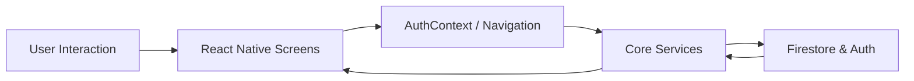

Actions in the UI propagate through context providers and service modules, hitting Firestore for CRUD and real-time sync, then bubbling results back to components. Offline queuing, notification hooks and analytics side‑effects are woven into this chain.

The application relies heavily on dynamic, **Role-Based Access Control (RBAC)**. New users default to the restricted "Donor" role. Operational dashboards, task claiming APIs, and administrative oversight tools are tightly gated behind Firebase Authentication profiles that must be elevated by an existing Administrator.

> 📖 **Deep Dive into Features:** For an exhaustive breakdown of the platform's capabilities—including the Sync Engine, the Gamification mechanics, and precise Administrative capabilities—please read [**FEATURES.md**](./FEATURES.md).

---

## 🛠️ Tech Stack

*   **Frontend Framework:** React Native (via Expo framework)
*   **Routing:** React Navigation v6 (Bottom Tabs, Stack Navigators)
*   **Language:** TypeScript (Strict Mode)
*   **Backend & Auth:** Firebase (Authentication, Firestore Database)
*   **State Management:** React Context API (`AuthProvider`, `ToastProvider`)
*   **UI Components:** Custom design system (`theme.ts`) utilizing `expo-vector-icons`.

## 📷 Screenshots — All Roles

### 🔐 Authentication
| Login |
|:---:|
| 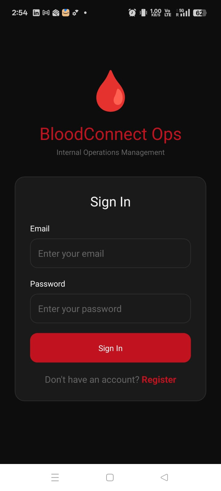 |

### 👤 Volunteer Role
| Volunteer Dashboard | Volunteer Tasks | Impact Passport & Leaderboard |
|:---:|:---:|:---:|
| 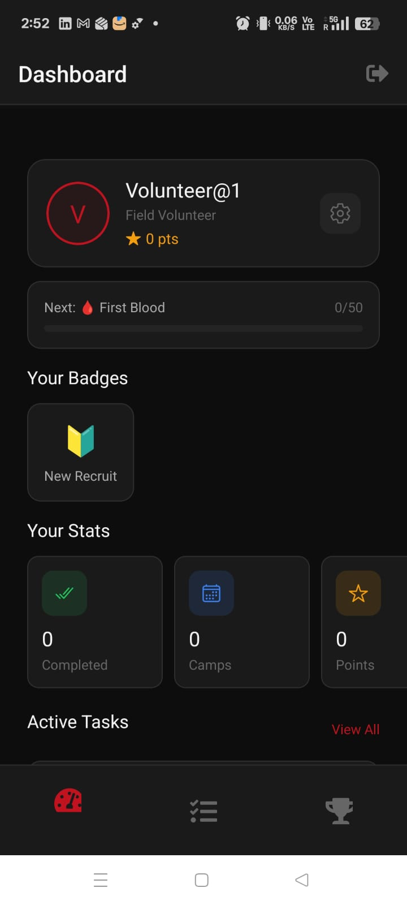 | 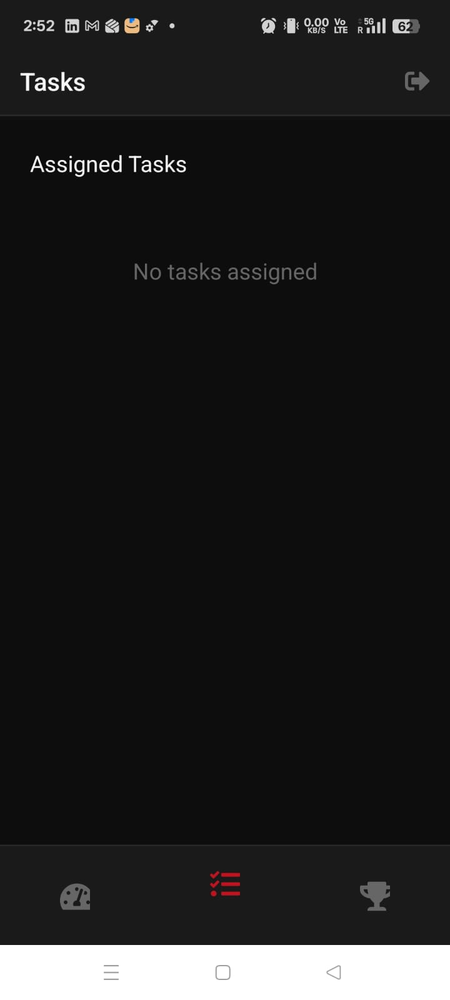 | 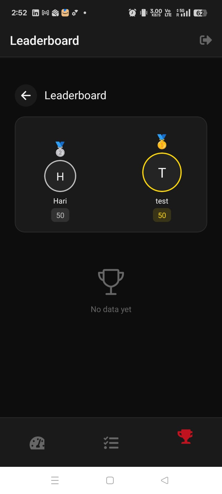 |

### 🚨 Helpline Operator Role
| Helpline Dashboard | Blood Request Details | Helpline Calls |
|:---:|:---:|:---:|
| 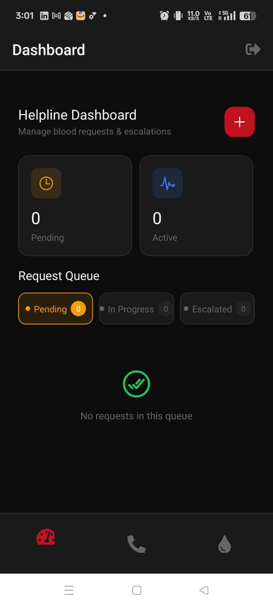 | 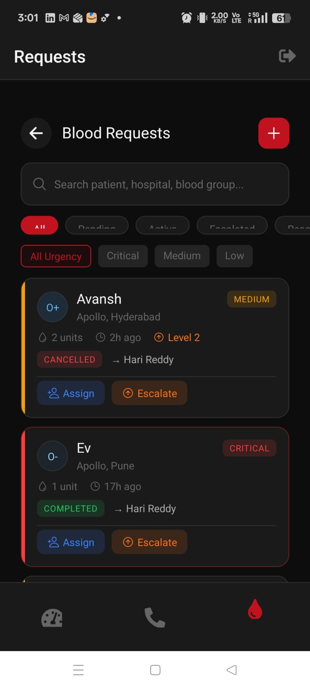 | 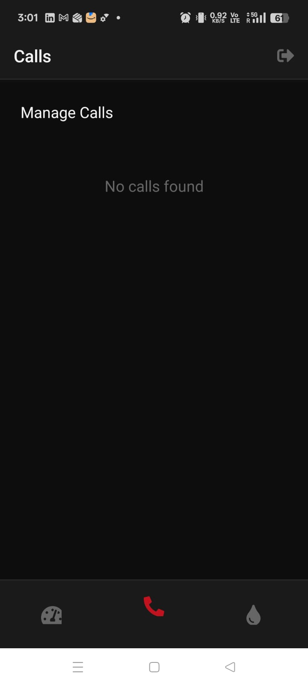 |

### 👔 HR / Volunteer Manager Role
| HR Dashboard | Manage Volunteers | Volunteer Details |
|:---:|:---:|:---:|
| 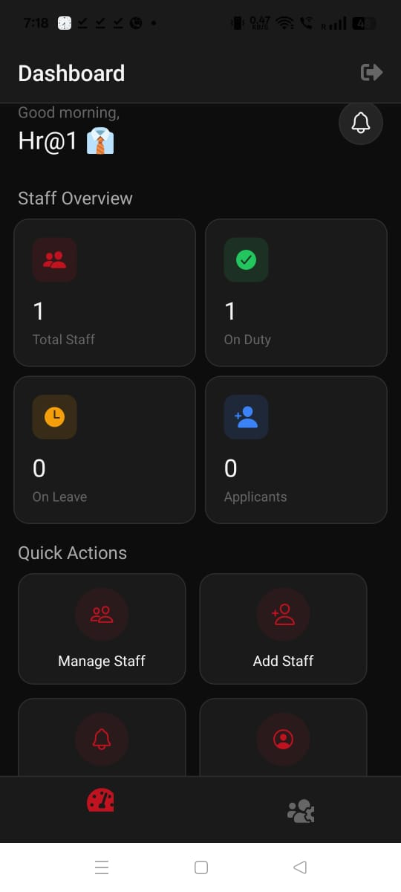 | 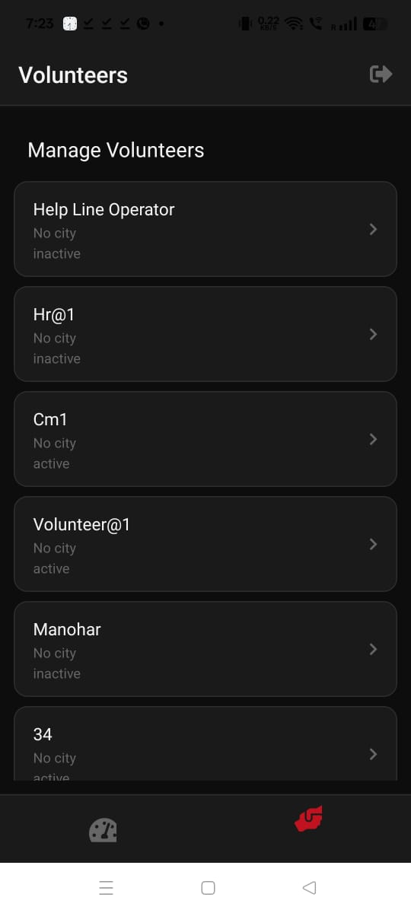 | 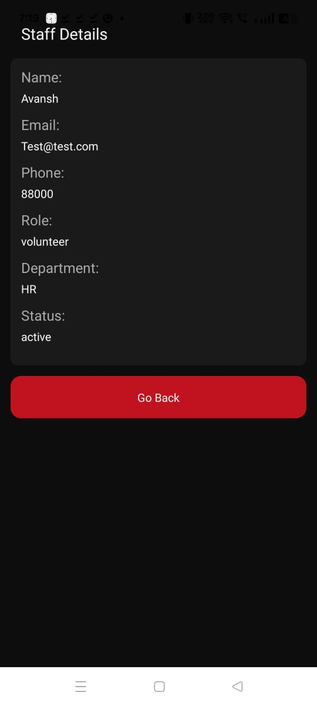 |

### 🏙️ City Manager Role
| City Manager Dashboard | Manage Staff |
|:---:|:---:|
| 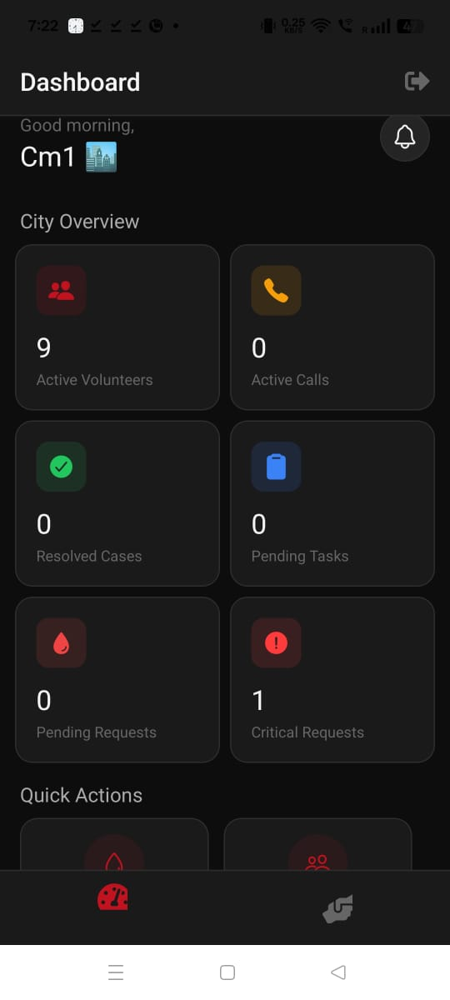 | 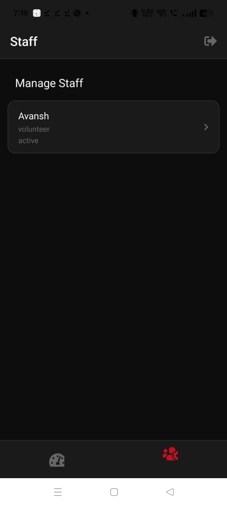 |

### 🎖️ Donor Certificate
| Post-Donation Certificate |
|:---:|
| Dynamic React Native component that generates personalized certificates for donors after blood donation |
| Displays donor name, blood group, donation date, quantity donated, total donations count, and unique certificate number |
| Data fetched from Firebase Firestore - unique for every user based on their donation history |

## 🌟 Core Feature Domains

1.  **Strict Role Hierarchies:** Unique UI dashboards for Donors (Public view), Volunteers (Task Execution view), and Admins/HR (Oversight & Management view).
2.  **Real-Time Task Sync:** Firestore `onSnapshot` listeners provide instant updates across all volunteer devices when a blood request is claimed or completed, preventing duplicate efforts.
3.  **Gamified Impact System:** An automated engine that rewards points for tasks, parses those points into rank tiers, and automatically awards achievements/badges (e.g., "First Blood", "Hero").
4.  **Social Sharing:** Integrated Native Share APIs allow volunteers to broadcast their impact stats and earned badges directly to their social media networks.
5.  **Administrative Command Center:** Deep dive pages allow admins to view user health, promote donors to volunteers, instantly assign critical tasks, and view global system statistics.

## 💡 Innovative Ideas

* **WarRoom Countdown:** A 30‑minute timer for critical requests with volunteer acceptance tracking to prevent “orphaned” tasks.
* **BloodRadar Heatmap:** Live city‑level visualization of blood availability, aiding dispatch decisions during shortages.
* **Offline Action Queue:** Volunteers can perform actions offline; they sync automatically when connectivity returns.
* **Impact Passport:** Personal stats and achievement tracker that encourages volunteer engagement and sharing.
* **Compliance‑Aware Donor Cooldown:** Automatically marks donors unavailable for 90 days post‑donation per regulatory guidelines.
* **Dynamic Role Navigator:** App loads only necessary screens for a user’s role, reducing bundle size and cognitive load.

---

## 📂 Project Structure

```text
bloodredapp/
├── app/                      # Expo Router / Root Views (If migrating to Expo Router v3)
├── src/
│   ├── components/           # Reusable UI elements (AppButton, AppInput, StatCard)
│   │   └── ui/               # Granular atomic UI components
│   ├── config/               # Firebase initialization and schema documentation
│   ├── constants/            # Global styling tokens, COLORS, FONTS (theme.ts)
│   ├── navigation/           # React Navigation configurations (RootNavigator, etc.)
│   ├── screens/              # Page-level components organized by role
│   │   ├── admin/            # Dashboards for system administrators
│   │   ├── auth/             # Login and Registration flows
│   │   ├── shared/           # Overlapping screens (Profile, Tasks, Badges)
│   │   └── volunteer/        # Volunteer Dashboard and Task flows
│   ├── services/             # Firestore CRUD wrappers and business logic (taskService, profileService)
│   ├── stores/               # Global Context Providers (AuthProvider, ToastProvider)
│   └── types/                # Strict TypeScript database definitions
├── App.tsx                   # Main entry point hook
└── FEATURES.md               # Detailed feature specification document
```

---

## 🚀 Local Development Setup

### Prerequisites
*   Node.js (v18+ recommended)
*   npm or yarn
*   Expo CLI installed globally (`npm i -g expo-cli`)
*   A Firebase project with Firestore and Authentication (Email/Password) enabled.

### 1. Clone & Install
```bash
git clone https://github.com/your-org/bloodconnect-ops.git
cd bloodconnect-ops
npm install
```

### 2. Configure Firebase
Provide your Firebase keys to the application. Create a `.env` file or configure `src/config/firebase.ts` directly with your web config object:
```javascript
const firebaseConfig = {
  apiKey: "AIzaSy...",
  authDomain: "your-project.firebaseapp.com",
  projectId: "your-project",
  storageBucket: "your-project.appspot.com",
  messagingSenderId: "123456789",
  appId: "1:123456:web:abcd123"
};
```

*(Note: Never commit your actual raw `.env` or production API keys to public source control.)*

### 🔐 Test Accounts & Credentials
Use the following test accounts; **the password for all roles is `123456`** (copy & paste for convenience). These are seeded in the demo database.

| 🎭 Role        | 📧 Email                        | 🔑 Password | 📝 Notes                          |
|----------------|---------------------------------|-------------|-----------------------------------|
| Volunteer      | volunteer_test@gmail.com        | 123456      | Field volunteer (task executor)   |
| HR Manager     | hr_test@gmail.com               | 123456      | Volunteer management & campaigns  |
| 🚨 Helpline Op | helplineoperator@gmail.com      | 123456      | Request intake & assignment       |
| City Manager   | Cm1@gmail.com                   | 123456      | City oversight & analytics        |
| 🛡️ Admin       | dev@test.com                    | 123456      | System admin & user management    |

> 🔺 **Tip:** Copy the password `123456` and paste into the app to avoid typing errors. Test each role to explore role-specific dashboards.

### 3. Start the Server
```bash
npm start
```
*   Press `a` to open on an Android emulator or connected device.
*   Press `i` to open an iOS simulator (Mac only).
*   Scan the QR code with the Expo Go app on your physical device to test instantly.

### 4. Admin Account Initialization
By default, new registrations are assigned the `donor` role. To gain access to the `AdminNavigator`:
1. Register a new user in the app (e.g., `admin@test.com`).
2. Open your Firebase Console -> Firestore.
3. Locate the `profiles` collection, find your user document (matching your Auth UID).
4. Change the `role` field from `"donor"` to `"admin"`.
5. Restart or log back into the app.

---

## 🗄️ Database Schema Preview

The platform utilizes a denormalized NoSQL structure optimized for rapid localized reads.

- **`profiles`:** The ultimate source of truth for Role (`donor`, `volunteer`, `admin`) and basic contact info.
- **`volunteers`:** A secondary table storing operational stats (`points`, `badges`, `tasks_completed`), populated only upon promotion from Donor.
- **`tasks` / `bloodRequests`:** Operational tables synced real-time to active volunteers.
- **`leaderboard`:** A highly optimized aggregation table storing the top 50 volunteers for a given `city` node.

See `src/types/database.ts` for strictly typed interfaces.

---

## 🚢 Contributing & Deployment

### Building for Production
This app is ready for EAS (Expo Application Services) builds.

**Android (APK):**
```bash
npx expo run:android --variant release
# OR
eas build -p android --profile production
```

**iOS:**
``.   bash use it there 
```

When contributing, please ensure all TypeScript interfaces are strictly adhered to, particularly when modifying shared `services` that interact with the Firestore instances, to prevent `undefined` crashes across platforms.

**VIDEO**
https://youtu.be/nXnvv3FiDk8


